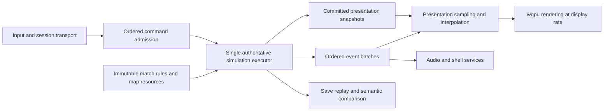

# Yuri's Revenge 1.001 — agentic compatibility master plan

Execution v1, 2026-10-03. Planning is accepted; implementation, scoped PRs, merges
and fast-forward updates of local main are authorized. The implementation
sequence remains evidence-driven. Initial source inspected at
`7e932b968e9b901142d80944095af68fe178ebdc`.

**Build the most faithful practical Rust implementation of vanilla Yuri's Revenge
1.001, using original retail data, with smooth independent rendering and modern
optimization that preserves gameplay.** Fidelity takes priority over the upstream
20,000-unit/30-player target. Rust, wgpu and the existing owners are reusable
starting material, not a reason to preserve a demonstrated incompatibility.

Start with the [discovery findings](yr1001-discovery.md), select work from the
[work packages](yr1001-work-packages.md), and resume from the single
[checkpoint](yr1001-checkpoint.md). The [execution brief](yr1001-execution-brief.md)
is the launch/continuation entry point. This plan replaces upstream delivery
priorities for this compatibility program; older plans remain evidence leads.

## Implementation progress

Update this table when a task changes state. A delivered prerequisite does not
close its parent package. The checkpoint records active work and exact validation;
this table records completed scope and remaining package acceptance.

| Task | State | Completed scope / remaining acceptance |
| --- | --- | --- |
| Delivery bootstrap | Done | [PR #1](https://github.com/ckbk456/vera20k/pull/1) merged at `0b099399`; primary main fast-forwarded. Exact-head Python/Clippy (three platforms each) and field-ratchet workflows passed. `delivery` targets the user-owned fork, `origin` preserves upstream. |
| B01: official installation intake | Done for intake | Steam app 2229850/build 15918130/English; 436 files and 1,961,731,509 bytes match Windows-source SHA-256. Genuine movie archives acquired; receipts remain local/ignored. |
| B01: candidate identity tooling | Done for bounded tooling scope | [PR #3](https://github.com/ckbk456/vera20k/pull/3) merged at `f554f845`; seven exact-head CI checks passed and primary main fast-forwarded. `native_inspect identity` reuses the PE/two fixture owners. [Steam receipt](../../tools/native_inspect.steam-15918130.identity.json): 11/11 bounded regions match. Default execution remains closed; explicit clock/caller profiles are qualified below. |
| Tooling: local macOS process fixture | Done | [PR #4](https://github.com/ckbk456/vera20k/pull/4) merged at `726f330b`; seven exact-head checks passed, primary main fast-forwarded and issue #2 closed. Disposable copied sleep executable is signed on macOS; three focused process checks and 555 Python tests (five optional skips) pass. |
| B01: native variant and retail baseline | Open | Qualify Steam code/address/behavior compatibility and production-selected retail input/layer identities. Acquisition alone does not close B01. |
| B02: native tooling environment | Partial | Isolated Python 3.14 environment has pinned Unicorn2.1.4/Capstone5.0.7. Explicit Steam clock/timer and prepared DRAGON caller/ring closures execute with guarded identities. Full world execution and native game capture remain unqualified. |
| S2 / R01: event-loop runtime and service opportunities | Done for bounded seam | [PR #5](https://github.com/ckbk456/vera20k/pull/5) merged at `627f982b`; seven exact-head checks passed and primary main fast-forwarded. [Bounded chain and acceptance](yr1001-stage2-runtime.md): ordinary redraw no longer admits gameplay or pumps audio/exit; event-loop services retain focus/pause/startup/terminal gates and bounded hidden-window wakes. Display-owned effects retain their prior cadence. Immutable worker handoff, stall independence and whole R01 acceptance remain open. |
| S2 prerequisite: bounded Steam clock/timer/throttle execution | Done for bounded chain | [PR #6](https://github.com/ckbk456/vera20k/pull/6). [Clock chain](yr1001-clock-qualification.md). Explicit scoped profile in the existing native oracle and throttle owners; default historical image gate remains closed. 168 joined native timer histories, 112 setup controls and 37 throttle replays expose and protect the corrected speed-0 clock-rollover admission. Required checks, release regression capture and one defect-free critic pass; [PR #6](https://github.com/ckbk456/vera20k/pull/6) merged at `1642ac9f`; seven checks passed at head `5c43ac37`, primary main fast-forwarded. Full F01/F02 is not implied. |
| S2 / R03 prerequisite: joined legacy composite admission | Done for bounded chain | [PR #7](https://github.com/ckbk456/vera20k/pull/7) merged at `7743c549`; seven checks passed at `42585a36`, primary main fast-forwarded. [DRAGON chain](yr1001-legacy-composite.md): eight authenticated native caller histories; one retained Display ordering for every parent and pre-Logic body/trail phase. Redraw only reprojects; initial/restore seed without ring aging; joint clear includes score exit. One critic's two P2 findings fixed with failed-first regressions. Final retail lib9588/0/231, clippy, Python573/five skips and native reproductions pass. Four reviewed release captures preserve gameplay transcripts; flight/impact differ only in Bullet/trail pixels, initial/drained frames match. Whole R03 remains open. |
| S2 / F01 prerequisite: admitted frame independent of diagnostic duration | Done for bounded chain | [PR #8](https://github.com/ckbk456/vera20k/pull/8) merged at `b43304db`. [Admitted-frame chain](yr1001-frame-duration.md): combat no longer drops queued impacts at duration zero; unused combat duration forwarding is removed. Failed-first real V3 regression now compares full output, RNG, lifecycle and hash for 0/1/22/66/1000/MAX labels. Existing authenticated zero-clock Main results protect caller admission/commit only. Retail lib 9,589/0/231 ignored, Clippy and unchanged 2,513-field ratchet pass. One fresh critic found no actionable defects. Native Rocket impact ordering, sparkle clocks and full F01 remain open. |
| W02 prerequisite: ordered Bullet CRT and retained live type/asset readers | Done for bounded native chain | [PR #10](https://github.com/ckbk456/vera20k/pull/10) merged at `b65a8eb9`; seven required checks passed on exact `c01c4dde` and primary main fast-forwarded cleanly. [Scoped chain](yr1001-bullet-live-readers.md): one native VM reaches `668EF5`, 1,976 primary entries / 16 families, 32 Missions, 606 postpasses, 265 constructors and 15 checks true; three RNG stores unchanged. Two critic findings fixed and final Python/native checks pass. Source-only prerequisite; whole W02 and gameplay/human acceptance remain open. |
| W02 prerequisite: complete retained root Rules.Process return | Bounded native qualification and sole critic passed; delivery pending | [Process-tail chain](yr1001-rules-process-tail.md), implementation `a92d0f701`: original Tiberium CRT index3220 before Scenario; one fresh retained VM through actual `668FA2` RET4 in 2609.295s. All2468 producers unchanged, four output/raw bindings, 18 tail checks true; 12 tail calls, 118 Warhead rereads, four Tiberium rows and six ID-bearing constructors. All three RNG stores unchanged / zero observed draws. Native 121 checks and portable 669/28 skips pass; sole fresh read-only critic found no confirmed actionable defects in the qualified path. No Rust source change. Only stock cold mode0/absent command-bar qualified. Later Rules layers, accepted Session/House/placement and paid Move/Stop/resume remain open. |
| S2 / R02–R04 | Open | Vehicle pose/picking continuity, qualified legacy composite cadence and worker lifecycle require F01/F02 and selected W02 evidence. Single-thread event-loop separation cannot close Stage 2. |
| B03, F01–F03 and later gameplay packages | Open | Discovery leads exist; no complete native capability census or joined production/native execution spine is qualified. |

Delivery repository: https://github.com/ckbk456/vera20k. PRs target its `main`;
branch from fetched `delivery/main`, merge one validated scoped PR at a time,
then fast-forward the clean primary checkout. Preserve upstream and licensed
local files. Main requires seven CI checks (Python/Clippy on three platforms and
the field ratchet), including for admins; no human approval gate is required.
Human playtesting/feel acceptance remains separate from agent checks.

## 1. Baseline and scope

The reference is **authenticated vanilla Yuri's Revenge 1.001**, with explicit
executable, language, patch/archive, rules, mode, map and configuration identities.
Version strings or a plausible game launch do not establish the baseline. Preserve
the supplied installation and describe executable variants separately.

The compatibility census covers:

- Every country, side, retail unit/building/weapon/warhead/projectile and relevant
  civilian, campaign, preplaced, reinforcement, veteran/elite and acquisition path.
- Rules/ART/AI/sound/EVA/theme readers, constructor defaults, native layering,
  parsing, clamps, postpasses, and vanilla-supported authorable/dormant behavior.
- Fixed and random maps, theaters, terrain, overlays, bridges, resources, shroud,
  occupancy, placement and collision; scenario initialization and teardown.
- Commands, selection, missions, locomotors, economy, production, combat, special
  abilities, strategic powers, AI, Teams/scripts, Tags/triggers and game outcomes.
- Skirmish and shipped modes including cooperative scenarios; both YR campaigns,
  objectives, difficulty-dependent branches, progression and terminal outcomes.
- Shells, options, input/hotkeys/cursors, camera/radar/sidebar, legacy graphics,
  sound/EVA/music, briefing/movie/media lifecycle and score screens.
- Save/resume, loading native saves, writing native-compatible saves, and multiplayer
  session/command/checksum/packet behavior, including a native-client LAN
  interoperability investigation and acceptance route.

Native save-file and network interoperability are separate tracked capabilities;
Rust-only save round trips or two Rust peers agreeing do not close them. Discovery
must establish attainable compatibility before selecting their implementation.
If a dimension proves impractical, it remains an explicit baseline gap until the
user narrows the requirement. An arbitrary existing VERA format is not a substitute.

Ares, Phobos, Antares behavior, arbitrary injected DLLs, increased game limits,
balance changes, new units, a new editor and a replacement online service are later
programs. Keep their source references available, but do not introduce extension
features or extension bug fixes into the vanilla authority. Investigate game-side
legacy online behavior; availability of historical services is an external
capability, not something a Rust port can certify. No online-service completion
claim without a named, working service and its acceptance evidence.

Preserve defined native quirks when they affect outcomes or vanilla maps/content.
Do not reproduce unsafe memory access merely for source resemblance. Safe recovery
that differs from native behavior is a named compatibility residual. Modern
intermediate visual samples are allowed; simulation results and discrete event
order remain faithful. Neither reconstructed C++ structure nor function counts
define completion.

## 2. Evidence and numeric policy

Two requirements apply independently: equal Rust results across supported
platforms/architectures, and faithful results relative to the native baseline.
Cross-platform determinism alone proves neither native behavior nor correctness.

Choose numeric representation from the mechanism's actual contract. Use SimFixed
where its result is equivalent over the required domain. Retain or implement
deterministic native-width/rounding arithmetic where it matters. The existing
integer-backed native-x87 subset is reusable, not proof that every x87 instruction
or ambient precision state is supported. Establish widths, overflow, signedness,
rounding, comparison branches, RNG draws and timer boundaries through checked
native execution. A documented small error is an unresolved difference until its
future-state effects and covered range are understood; do not silently tolerate it.

Evidence labels remain distinct:

| Claim | Required evidence |
| --- | --- |
| Native behavior established | Instructions, callers, initialization and retail reads; reachability and supplied boundaries stated |
| Rust regression protected | Named production-consumer tests and actual run receipt at the candidate revision |
| Native parity demonstrated for a scope | Checked original execution/capture versus the production Rust owner with independent inputs and bounded coverage |
| Human accepted | Named build/scenario/platform and a recorded human playtest result |

Goldens come from authenticated original execution, capture or retail bytes, never
from a hand calculation, reconstructed C++ or previous Rust output. Original
state supplied by a fixture needs its own provenance. Validate instrumentation
as observer-only, and report substituted calls, imports, memory, constructors,
clock inputs and unexecuted branches. A Rust before/after hash is regression
evidence; it is not native parity. Matching final state alone misses transient
ordering, event, timer and RNG differences.

Do not claim whole-game equivalence from samples. Maintain a capability census
whose required branches are covered, unimplemented, unproven or explicitly
excluded. Record unknowns honestly. Existing authored support and every
unsupported native dispatcher arm need investigation, not silent no-ops.

B03 creates one live `docs/plans/yr1001-census.md` for this baseline. Each capability
records its trigger/variants, authoritative Rust/native owners, prerequisite IDs,
native input/behavior evidence, production-consumer checks, coverage limits,
residuals, and human acceptance references. Use evidence states unknown / missing /
implemented-unqualified / native-qualified-for-scope / explicitly-excluded, with
links to actual receipts. The checkpoint owns active reservations and the next
queue; the census owns compatibility coverage, not another session diary. The old
gameplay catalogue remains a scope/evidence reference rather than a second live
status source. Do not create a new graph/registry tool merely to track this table.

## 3. Target execution architecture

Keep a single authoritative Simulation bound to immutable match resources through
SimRuntime. Storage layout may evolve; native Logic, Cell, House, Display and
registry orders are separately meaningful and cannot be replaced by sorted IDs.
Same-frame callbacks, newly appended objects and pending removal timing are part
of the behavior. Follow actual native order, not the simplified architecture tour.

### Three clock domains

1. **Logical simulation frames:** native admission, speed choice, pause, focus,
   network waits, commands and frame counters. Establish these from execution.
   A `1/15` mechanics fraction does not imply universal 15 Hz wall-clock pacing.
   Reconcile app, headless, capture and replay through one owner.
2. **Legacy presentation/service updates:** effects, trails, UI repeats, radar,
   audio/EVA/theme service and terminal waits have their own native triggers or
   time domains. Trace each. Sampling at 144 Hz must not advance an effect 144
   times if its native update policy says otherwise.
3. **Display sampling:** redraw at the available refresh rate, independently of
   gameplay admission. Presentation can skip stale views, but not gameplay ticks
   or required ordered events. No displayed value becomes gameplay authority.

Keep native speed settings, pause/focus semantics and logical-frame arithmetic.
Remove the accidental display-refresh ceiling. Native stall recovery and uncapped
speed zero require explicit evidence; do not install a generic accumulator or
catch-up policy based on assumptions. Pause, minimization, surface loss, modal
dialogs and network stalls get separate tests. Do not promise smooth output when
the GPU itself cannot meet the display budget.

### Snapshot and event handoff

Publish bounded immutable presentation records after committed logical boundaries,
with stable object lifetime identity, frame/timeline generation and relevant pose,
visibility, depth, lighting and UI state. Use the existing sim output owner for
ordered effects, fire, sound, lifecycle and terrain events. Snapshots and events
have different loss policies: replace stale views; retain every required event
until acknowledged. Bound queues and define backpressure; do not block simulation
behind an unbounded GPU/readback wait. Gameplay transport events are never dropped.

Migrate live readers in rendering, picking, input, sidebar and audio. Borrowed
SimView and a serialized GameSnapshot are not automatically a valid concurrent
presentation boundary. Derived caches need source ownership, generation-aware
invalidation and consistent startup/restore/shutdown. Keep GPU/window work on
platform-required threads. A simulation executor thread is introduced only after
the ownership handoff works; thread count is not the decoupling acceptance test.

Interpolate continuous poses first for one ground vehicle. Give selection brackets,
health bars, shadows and attached effects one sampled pose. Keep animation/event
admission discrete. Reset history on spawn, removal, teleport, load, transport,
map change and other discontinuities. Do not interpolate through walls or teleport
paths just because coordinates permit it. Define latency and maximum snapshot-age
budgets from measurements; retain a native-frame reference sampling mode.

Clicks may select the stable object shown on screen, but command execution must
revalidate its current lifetime, owner, visibility and legal action. Cell targeting
uses the canonical camera/projection mapping and authoritative admission. Avoid
inventing a frame of future gameplay through prediction. Every async command has
a defined execution-frame assignment, including pause, late arrival and shutdown.

### Optimization and parallelism

Profile qualified production chains. Start with independent asset decoding, voxel
poses, culling and presentation preparation; reuse existing deterministic joins.
For simulation, workers may compute from immutable inputs only when all dependencies
and same-frame visibility are established. Commit results in the proven native
order. Never give workers independent RNG streams to make parallelization easy.
Never delay a same-frame side effect until a batch end unless equivalence is proved.

Use worker-count and scheduling-perturbation matrices, full RNG/event/timer traces,
save/load continuations and architecture comparisons. Preserve a sequential
reference implementation until each optimization is qualified; do not create a
second permanent gameplay owner. Measure simulation cost, extraction cost, GPU and
present time, snapshot age, input latency, queue pressure and frame-time tails.
Absolute performance budgets are set from representative hardware in baseline
qualification; 20k units is not a prerequisite for vanilla acceptance.

## 4. Delivery stages and dependencies

Stages organize areas; they are not giant PRs or rigid barriers to independent work.
An area closes only when its required chains and evidence close. Revisit priorities
when the next production comparison finds a more consequential divergence.

| Stage | Outcome | First meaningful chunks | Dependency/exit |
| --- | --- | --- | --- |
| S0 | Reproducible native and retail baseline | B01–B03: binary identity, machine/native host capability, live compatibility census | Native comparison provenance and explicit unavailable capabilities; independent discovery may continue while a host/media dependency is blocked |
| S1 | One causal execution and comparison spine | F01–F03: clocks/commands/order, semantic first-divergence comparison, first bounded retail route | S0 execution capability; native and Rust initialization correspondence, RNG and command histories |
| S2 | Smooth independent presentation without gameplay drift | R01–R04: runtime services and snapshots, ground-vehicle interpolation, effects cadence, executor lifecycle | F01/F02; same gameplay traces across display schedules, exact event delivery, human motion/input check |
| S3 | Ordinary playable vanilla match foundation | W01–W04, E01–E03, P01–P03, C01–C02 | S1; movement/economy/base/combat chains through production input and cleanup, load/resume for affected state |
| S4 | Faction and strategic mechanism closure | W05, U01–U04, C03, X01–X04 | Required S3 owners; per-ability complete chains and faction/mode coverage |
| S5 | Native AI and authored scenarios | A01–A03, T01–T03 | Census starts at S0; implement selected scenario prerequisites as soon as owners exist, rather than waiting for all special weapons |
| S6 | Complete campaign, continuity and multiplayer | K01–K02, Q01–Q03, N01–N03 | AI/Tags/scripts and selected gameplay; native-save and packet investigations start earlier; complete retail mission/session acceptance |
| S7 | Legacy presentation/content closure | V01–V03, H01–H03 | Runs alongside S3–S6 when a chain is ready; native frame/GPU/audio/media evidence plus human feel/device checks |
| S8 | Measured performance and deterministic workers | O01–O02 | Optimize only qualified chains; serial/parallel and render-rate equivalence, measurable production benefit |
| S9 | Vanilla 1.001 release qualification | Z01 | All required capabilities and human gates resolved, whole-scope audit, reproducible build/evidence bundle and documented limits |

Each ID is specified in [work packages](yr1001-work-packages.md). Larger families
are discovery/coverage categories: instantiate one shared-dependency, player-visible
chain at a time. One special unit or strategic power is normally one chain, not a
single PR covering its entire table row. Required prerequisites remain in scope.
Integration, save/load and cleanup are part of each affected package, not deferred
until S6. Native save/protocol investigations run early enough to shape state and
command contracts before expensive implementations settle.

### First execution queue

1. B01: authenticate the supplied executable, retail sources and supported native
   oracle variant. Preserve bytes and do not weaken the checksum gate.
2. B02: establish checked instruction/native execution and full-game capture host;
   bootstrap isolated pinned dependencies and prove access. Identify missing media.
3. B03 and Q02/N02 discovery in parallel: census the entire baseline, native save
   state and packet contracts, assign current owners and evidence status.
4. F01: compare native clocks/frame/command order and reconcile app/headless units.
5. F02/F03: joined native/Rust pilot using existing production observation, initially
   a bounded startup through first command or common unit action. Grow the AnyTown
   Allied MCV→power→barracks→refinery→factory→MTNK route only after prerequisites
   are demonstrated; do not turn this pilot into a claim about the whole match.
6. R01 then R02/R03: independent runtime services, handoff and one ground-vehicle
   visual route, with zero gameplay/RNG/event divergence under varied redraw rates.
7. Choose the highest-impact ordinary-match divergence from the census/pilot, and
   continue through S3 while independent scenario/evidence discovery proceeds.

## 5. Fully agentic execution

Agents own discovery, decomposition, evidence collection, design, implementation,
integration, automated validation, profiling, diagnosis, review response,
documentation and release-candidate preparation. Humans perform hands-on playtesting,
legacy-feel assessment and device/audio acceptance. The user confirmed this split
on 2026-10-03. Human involvement is not a substitute for agents running machine checks.

### Responsibilities

| Role | Responsibility | Mutation boundary |
| --- | --- | --- |
| Coordinator | Reconcile checkpoint/repo/process state; select ready chains; reserve owners; assemble evidence and human packets; integrate and continue | Owns queue/checkpoint and integration, not a competing gameplay implementation |
| Chain owner | Trace one full mechanism and dependencies through native evidence, production integration, validation and cleanup | One owned feature worktree and assigned owners; no edits in another task's tree |
| Discovery worker | Resolve independent native/data/architecture questions; report observed/inferred/unknown findings and reproducible evidence | Read-only by default; tool/harness changes require an explicit assigned ownership boundary |
| Evidence/tool owner | Extend existing oracle/capture/comparison owner; validate provenance, inputs, limits and retail reachability | Owns that tooling chain; serializes shared database/harness writes |
| Fresh critic | Challenge implementation, omissions, authority, ordering, evidence and tests after validation | Read-only; exactly one substantive pass per substantial mechanism, not repeated per edit |

With four agent slots: one coordinator, one active implementation owner and up to
two independent discovery/evidence workers. Replace a worker with a fresh critic
when a mechanism reaches review. Research can run ahead. Overlapping implementations
do not run concurrently; independent changes still converge through one integration
queue. Do not stack unmerged branches or open PRs for isolated gaps in one chain.
An owned local predecessor commits into the local integration line before a new
dependent chain branches; unmerged publication branches follow the same serial rule.

For local-only execution, establish `feature/yr1001-integration` from fetched
`origin/main`; each owned chain starts from its validated committed head and returns
there before dependent work. This is the explicit narrow feature-base exception in
AGENTS.md/CLAUDE.md. Qualify the actual integration candidate, not an earlier child
head, and never use local main as the integration workspace. The draft-plan branch
is not automatically that execution branch. When remote delivery is configured,
switch to the user-owned repository's ordinary fetched-main/PR flow deliberately.

### Work selection and closure loop

1. Read the checkpoint, current contracts, relevant owner headers and saved evidence;
   verify actual Git/HEAD/process/retail state. Stale ledgers are hypotheses.
2. Select the first ready, frequent/player-visible or determinism-critical divergence.
   Write a compact task brief: trigger→prerequisites→admission→effects→consumers→cleanup,
   native sources, owner, dependencies, complete finish line and publication scope.
3. Reserve the owner/worktree in the checkpoint. Workers receive explicit read/write
   scope, revision, deliverable and stop boundary. Use current native/Rust ownership;
   search addresses and names before porting a function.
4. Establish expected behavior from native execution where numerical/timing/RNG
   behavior matters. Make a meaningful focused regression fail before fixing when
   practical. Reproduce uncertainty instead of inventing a default.
5. Implement the whole chain and its prerequisites. Migrate touched consumers,
   remove superseded state/copies and enforce encapsulation. Preserve intentionally
   different native paths. Extend existing tools rather than adding parallel helpers.
6. Run focused checks during iteration; qualify the final candidate with required
   full lib/clippy/retail/production/native checks. Record candidate source/build
   identity, exact commands, results, skipped cases and actual coverage.
7. Give one fresh read-only critic the requirement, diff and literal results plus
   original evidence access. Fix confirmed defects; reject false positives with
   evidence. Focused revalidation covers fixes; repeat broad checks only when
   their tested scope was invalidated. Do not request a second critic routinely.
8. Commit the validated local chain. Where publication/merge is authorized for a
   configured repository, publish one PR, attach evidence, register it with the
   host, enable auto-merge, and confirm merge before the next dependent publication.
   Otherwise integrate local validated commits and preserve publish-ready metadata.
9. Update the existing capability row/evidence and the single current checkpoint;
   prepare a human packet when warranted; take the next ready chain. A blocker in
   one area does not stop independent work or become a new routine approval request.

Autonomy is bounded by actual authority. The user launched implementation and
authorized scoped PRs, merges and fast-forward updates of main. Delivery is to
`ckbk456/vera20k` through the `delivery` remote; `origin` preserves
`YuriPlanet/vera20k` as source only. Do not publish this different vision upstream.
Routine design choices and fixes need no human approval within this launched scope.
No agent may claim access to an unavailable
native host, licensed media, CI account or device; report the dependency and keep
independent work moving. Do not send messages to people or unrelated chats.

### Resume and stop behavior

Keep one concise current checkpoint, not a diary. It names active worktree/branch/HEAD,
dirty/unmerged work, reservations, next ready package, actual validation/evidence,
critic/publication state, blockers and queued human acceptance. Every new session
reconciles it with real state. Preserve explicit scope amendments and stop requests.
At a planned pause finish owned operations and leave no owned builds/servers pending.
On an immediate stop start no further work; report owned running operations and
clean up only those the task started. Never kill another session's compile.

## 6. Automated gates and human acceptance

Keep Cargo serialized through the project runner and use one-shot `--lib` tests.
One CPU-intensive command per worktree; no baseline full-suite runs and no watch
mode. All final Rust candidates use retail INIs and
`VERA20K_REQUIRE_RETAIL_INI=1` for the full lib suite and clippy. Loader/asset/rules
changes also need release production retail map load. Gameplay needs the selected
native corpus plus actual production route; GPU changes need rendered readbacks,
not only CPU assertions. Sim write-field ratchet and touched-file ownership checks
remain required. See [project validation](../../AGENTS.md#git-and-validation).

Public data-free CI and authenticated private/local retail-native validation are
separate. Present CI's exact scope: existing cross-platform lib workflows are manual
and may skip retail inputs. Qualification must fail missing required inputs rather
than convert them into green skips. Extend existing CI/receipts for candidate
canonical traces on Windows/Linux/macOS and x86-64/ARM64 where available; compilation
does not prove equal simulation traces. Hardware/native-capture checks remain
explicitly unavailable until a real runner/device exists. Agents dispatch/check CI
only where publication/service authority is configured.

Proposed verification matrices (test inputs, not native timing assumptions):

- Multiple native game speeds, pause/focus/modal/stall/uncapped transitions.
- Identical tick-stamped commands with 30/60/120/144 Hz synthetic redraw schedules,
  dropped redraws, long surface stalls, and presentation disabled.
- Worker counts 1/2/4/available maximum and perturbed completion order; all relevant
  state/RNG/event/lifecycle traces must agree within the declared covered scenario.
- Save/load at transition boundaries, then future command/state comparison;
  replay and peers consume identical command identities and ordering.
- All factions, theaters, selected modes, common match routes and every shipped
  campaign mission/difficulty-dependent branch in the final capability census.

Save/load continuation compares Rust to the corresponding **native restored
execution**, with independently established RNG reset/retention and matched
fresh-process or in-process context. Do not assume equality to an uninterrupted
run: native load can reset Scenario RNG while process-global Main RNG follows a
different policy. Diagnostic replay/checkpoint restoration has a distinct contract
and must not overwrite native game-load semantics merely to make a digest agree.

Human packets are batched by meaningful playable outcomes, not every PR. A packet
contains the named candidate and launch instructions, corresponding native setup,
scenario/seed/rules/config identities, automated results/limits, short steps and
specific observations, known residuals, and a clear pass/fail/blocked feedback form.
Agents prepare the assets/build/route and reproduce feedback into regression
evidence. No request for a human to debug source or hand-author a missing test.

| Packet | What the human checks |
| --- | --- |
| HP0: baseline and clocks | Original speed/feel, pause/focus and ordinary command response |
| HP1: smooth grounded motion | Movement/turn/stop, clicking and selection at high refresh, resize/minimize, event/audio synchronization |
| HP2: ordinary match | Base, economy, combat, death, repair/sale/capture, save/resume and terminal outcome |
| HP3: factions and powers | Ability feel, passengers, air/naval/Chrono behavior, strategic effect timing and aftermath |
| HP4: authored content | Campaign/co-op objectives, difficulty branches, AI competence, briefing/movie/progression |
| HP5: network and continuity | LAN with Rust/native peers as applicable, dropout/defeat, restore/replay and real input latency |
| HP6: release candidate | Legacy visuals/audio/controls, complete matches and campaigns, platform/device/performance checks |

Record human status separately from agent readiness: pending / accepted / rejected /
blocked / not applicable with reason. Agents cannot mark subjective human testing
passed. If human feedback finds a fidelity bug, agents own diagnosis and repair.
Continue independent qualified work while a packet waits; dependent release claims
remain gated. Missing movies prevent movie acceptance, not all gameplay research.

## 7. Completion and release claims

No date or percentage is assigned before census and native-host bootstrap. Estimate
individual chains after native reachability/dependencies and fixture readiness are
known. Report outcomes and unknowns, not functions translated or rows visited.

The vanilla baseline is ready only when:

1. The supported 1.001 binary/data variants are identified and every required census
   capability has a production implementation and stated native evidence. Required
   unknown/missing behavior and unexplained gameplay divergence remain open work.
2. Complete match/campaign/scenario/save/network routes pass their covered native
   comparisons and integration checks; native file/wire interoperability has its
   own result, never inferred from Rust-only behavior.
3. Rendering cadence/worker count/platform do not alter covered gameplay histories;
   independent presentation is smooth under the qualified hardware budget and
   ordered events survive skipped views.
4. Human packets are accepted for the supported platforms/content, or limitations
   are explicitly documented and approved for a narrower release scope.
5. Build/source/data/evidence identities and reproduction instructions are retained;
   license notices/provenance are preserved, licensed retail binaries/media are not
   distributed, and no unowned processes or worktree changes remain.

Report claims as **vanilla 1.001 compatible within the published coverage** until
the whole baseline census and its remaining gaps justify a broader statement.
Recording missing work, passing Rust tests, completing a sample or improving
performance does not complete the program.
